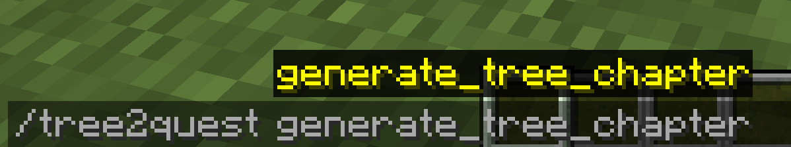
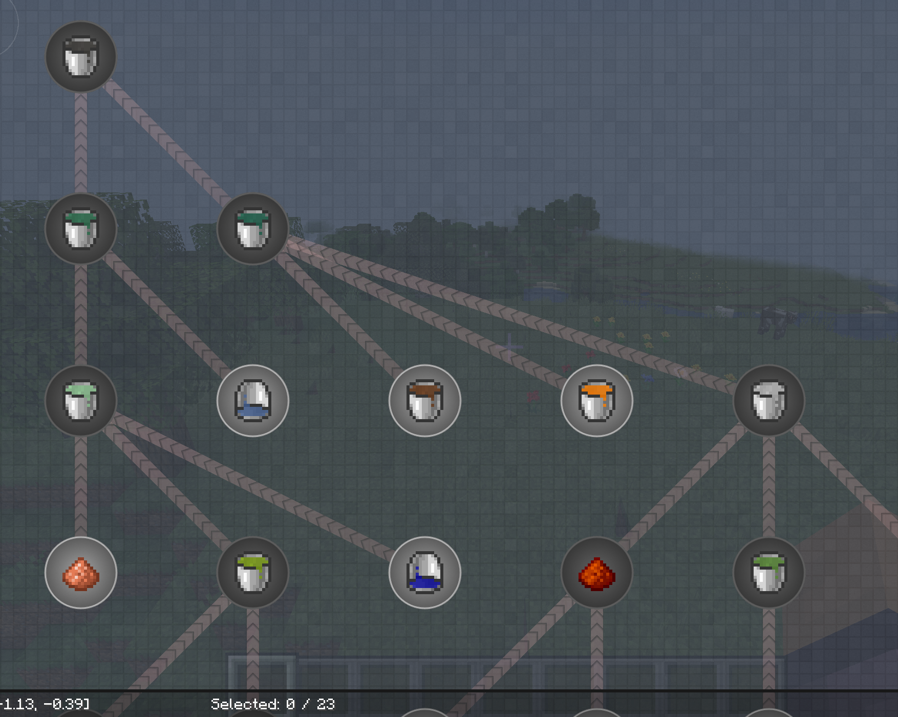

# EMI-Tree2Quest
EMI-Tree2Quest is a mod which can export EMI's Recipe Tree to FTB Quest!

# How to use
- Step 1: Select a recipe tree in EMI.
- Step 2: Type /tree2quest generate_tree_chapter in.

- Step 3: Type /ftbquests reload.

And it's done.

Example of result

# Note
When the recipe have two or more products,  generated quest will only choose the first. So you maybe need some manually tweaks.
